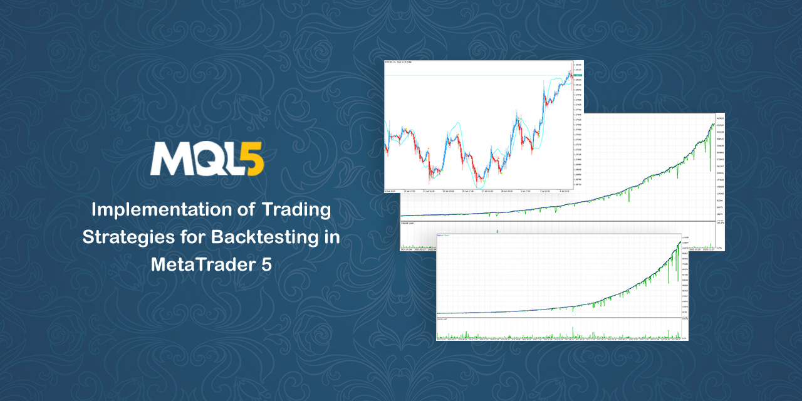

# 🤖 Trading Strategies

Implementation of Trading Strategies for Backtesting in MetaTrader 5 (MT5) Using MQL5 Programming Language – Free Open-Source Trading Bots (Expert Advisors) for MT5

| Expert Advisor | Download | Strategy Video | Backtesting Report | Description |
| --- | :---: | :---: | :---: | --- |
| [CEZLSMA](Experts/CEZLSMA.mq5) | [:label: v1.6](https://github.com/geraked/metatrader5/raw/master/Build/CEZLSMA/CEZLSMA-v1.6.ex5) | [:arrow_forward:](https://youtu.be/2U5VTWBBK8U) | [:chart_with_upwards_trend:](Test/CEZLSMA) | A strategy using [Chandelier Exit](Indicators/ChandelierExit.mq5) and [ZLSMA](Indicators/ZLSMA.mq5) indicators based on the Heikin Ashi candles |
| [3MAF](Experts/3MAF.mq5) | [:label: v1.5](https://github.com/geraked/metatrader5/raw/master/Build/3MAF/3MAF-v1.5.ex5) | [:arrow_forward:](https://youtu.be/bKPs2aOsvsk) | [:chart_with_upwards_trend:](Test/3MAF) | A strategy using three Moving Averages and Williams Fractals |
| [BBRSI](Experts/BBRSI.mq5) | [:label: v1.6](https://github.com/geraked/metatrader5/raw/master/Build/BBRSI/BBRSI-v1.6.ex5) | [:arrow_forward:](https://youtu.be/pCmJ8wsAS_w) | [:chart_with_upwards_trend:](Test/BBRSI) | A strategy using Bollinger Bands and RSI |
| [DHLAOS](Experts/DHLAOS.mq5) | [:label: v1.5](https://github.com/geraked/metatrader5/raw/master/Build/DHLAOS/DHLAOS-v1.5.ex5) | [:arrow_forward:](https://youtu.be/IZVSb1kjduQ) | [:chart_with_upwards_trend:](Test/DHLAOS) | A strategy using [Daily High/Low](Indicators/DailyHighLow.mq5) and [Andean Oscillator](Indicators/AndeanOscillator.mq5) indicators for scalping |
| [3MACD](Experts/3MACD.mq5) | [:label: v1.4](https://github.com/geraked/metatrader5/raw/master/Build/3MACD/3MACD-v1.4.ex5) | [:arrow_forward:](https://youtu.be/1sdYRBpthnM) | [:chart_with_upwards_trend:](Test/3MACD) | A strategy using triple MACDs for scalping |
| [2MACDSTO](Experts/2MACDSTO.mq5) | [:label: v1.4](https://github.com/geraked/metatrader5/raw/master/Build/2MACDSTO/2MACDSTO-v1.4.ex5) | [:arrow_forward:](https://youtu.be/yDJil-W-WJQ) | [:chart_with_upwards_trend:](Test/2MACDSTO) | A strategy using two MACDs and Stochastic Oscillator |
| [2MAAOS](Experts/2MAAOS.mq5) | [:label: v1.4](https://github.com/geraked/metatrader5/raw/master/Build/2MAAOS/2MAAOS-v1.4.ex5) | [:arrow_forward:](https://youtu.be/gQnpmH8ygJU) | [:chart_with_upwards_trend:](Test/2MAAOS) | A strategy using two Moving Averages and [Andean Oscillator](Indicators/AndeanOscillator.mq5) |
| [AFAOSMD](Experts/AFAOSMD.mq5) | [:label: v1.5](https://github.com/geraked/metatrader5/raw/master/Build/AFAOSMD/AFAOSMD-v1.5.ex5) | [:arrow_forward:](https://youtu.be/UYBLh1IvIVs) | [:chart_with_upwards_trend:](Test/AFAOSMD) | A strategy using [Average Force](Indicators/AverageForce.mq5), [Andean Oscillator](Indicators/AndeanOscillator.mq5), and MACD |
| [NWERSIASF](Experts/NWERSIASF.mq5) | [:label: v1.4](https://github.com/geraked/metatrader5/raw/master/Build/NWERSIASF/NWERSIASF-v1.4.ex5) | [:arrow_forward:](https://youtu.be/Olb47nBRSSo) | [:chart_with_upwards_trend:](Test/NWERSIASF) | A strategy using [Nadaraya-Watson Envelope](Indicators/NadarayaWatsonEnvelope.mq5), RSI, and [ATR Stop Loss Finder](Indicators/AtrSlFinder.mq5) indicators |
| [LRCUTB](Experts/LRCUTB.mq5) | [:label: v1.4](https://github.com/geraked/metatrader5/raw/master/Build/LRCUTB/LRCUTB-v1.4.ex5) | [:arrow_forward:](https://youtu.be/0ZzLlA9NFxo) | [:chart_with_upwards_trend:](Test/LRCUTB) | A strategy using [Linear Regression Candles](Indicators/LinearRegressionCandles.mq5) and [UT Bot Alerts](Indicators/UTBot.mq5) |
| [COT1](Experts/COT1.mq5) | [:label: v1.2](https://github.com/geraked/metatrader5/raw/master/Build/COT1/COT1-v1.2.ex5) | [:arrow_forward:](https://youtu.be/Dy1hk_NXwfs) | [:chart_with_upwards_trend:](Test/COT1) | A strategy using [Commitments of Traders (COT)](Include/Cot.mqh) and [Super Trend](Indicators/SuperTrend.mq5) indicator |


Additionally, there are strategies available for utilization within TradingView. If this piques your interest, you can explore them in this [repository](https://github.com/geraked/tradingview).

## ⚠️ Caution

Please be aware that some Expert Advisors (EAs) have been combined with the Grid technique to forcefully enhance profitability, but this approach also introduces significant risk. It's important to note that the optimal symbol, time frame, and parameters for each EA may vary depending on your broker and account specifications. Therefore, before deploying any EA on your live account, we strongly recommend conducting thorough backtesting to ensure its effectiveness and reliability.

## 🚀 Support This Project

Creating and maintaining this open-source project takes significant time and effort. If you find value in my work, consider supporting the project with a donation. Every contribution, no matter the size, helps sustain and improve the project.

To make a contribution, please send it in `USDT TRC20` to the following crypto address:

```
TUSZtoZGzwXxnL6KQ9RjimtY1TY7dTEjFL
```

Thank you for your support! 🙏❤️

### 🌟 Get Featured as a Sponsor

If you'd like to be recognized as a sponsor of this project, simply message me on Telegram `@Rsajedi2020` after your donation. I'll gladly add your name or organization to the list of sponsors.

## 🛠️ MQL5 Development Services

I’m available for MQL5 development projects! If you have a custom project or need a tailored solution, feel free to reach out to me. 

📩 **Contact me on Telegram**: `@Rsajedi2020` to discuss your requirements and get a quote. Let’s bring your trading ideas to life!

## 🏆 Credits

**Rabist [AUTHOR]** - view on [LinkedIn](https://www.linkedin.com/in/rabist).

## 📜 License

This project is licensed under the [MIT LICENSE](LICENSE). This means you can modify it however you want as long as the original copyright and license are included in your release.

## 🚨 Disclaimer

**USE AT YOUR OWN RISK:** Trading financial instruments involves a high level of risk, and there are no guarantees of profit. Markets are known for their volatility, and past performance is not indicative of future results.

**Not Financial Advice:** The information, EAs, and strategies presented in this repository do not constitute financial advice. You should consult with a qualified advisor and conduct your own research before making any trading decisions. Any decisions you make based on the content of this repository are your sole responsibility.

**No Liability:** The maintainers of this repository and contributors are not liable for any losses or damages incurred as a result of using the trading strategies, EAs, or information provided here. You assume full responsibility for your trading activities, and any gains or losses are entirely your own.

**No Warranty:** The trading strategies and EAs are provided "as is" without any warranty, express or implied. There is no guarantee that the EAs will be error-free or meet your specific requirements.

By using the trading strategies, EAs, or information in this repository, you acknowledge and accept the inherent risks associated with trading and agree to release the maintainers and contributors from any liability.

Always exercise caution and practice responsible trading. Your financial well-being is of utmost importance, and you should only trade with funds you can afford to lose.

Thank you for your understanding, and we wish you success in your trading endeavors.
