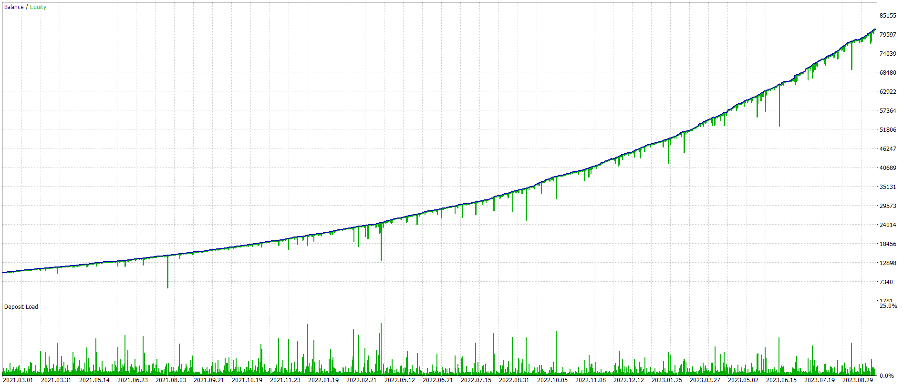
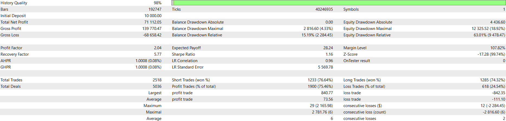

## 3MACD - Backtesting Report

-   **Symbol:** AUDUSD
-   **Time frame:** 5M
-   **Range:** 2021.02.22 - 2023.09.26
-   **Leverage:** 1:100
-   **Margin mode:** Hedging

**Note:** The pure implementation of the strategy explained in this [video](https://youtu.be/1sdYRBpthnM) was not profitable over the long term. The current implementation combines the inversion of the strategy with the Grid technique, which has made it profitable.

