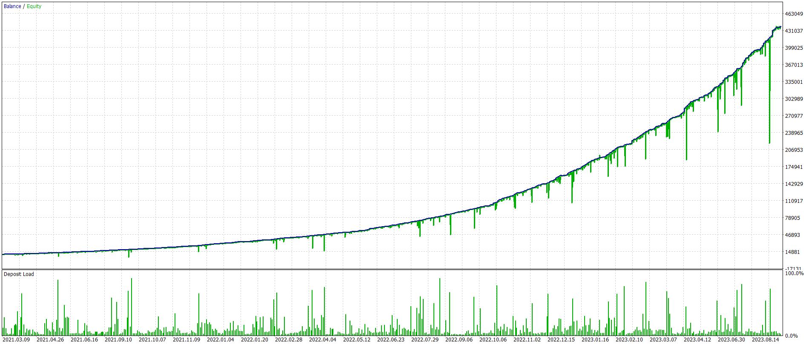
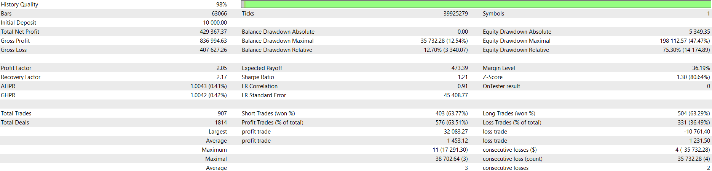

## 3MAF - Backtesting Report

-   **Symbol:** USDCAD
-   **Time frame:** 15M
-   **Range:** 2021.02.22 - 2023.09.08
-   **Leverage:** 1:100
-   **Margin mode:** Hedging
-   **Broker:** [360Capital](https://360capitalltd.com)

**Note:** The pure implementation of the strategy explained in this [video](https://youtu.be/bKPs2aOsvsk) was not profitable over the long term. The current implementation combines this strategy with the Grid technique, which has made it profitable.

