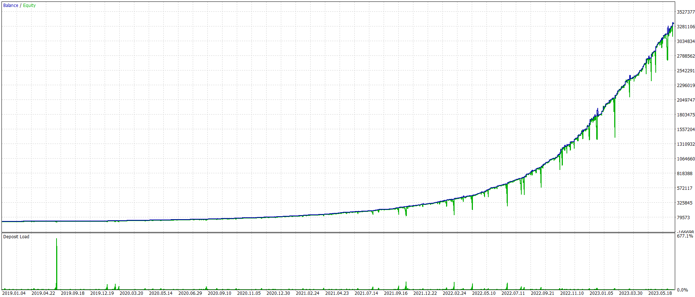
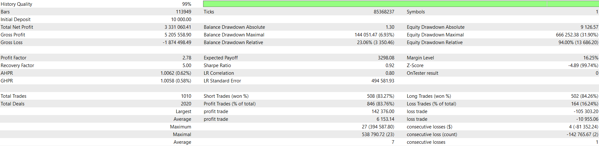

## CEZLSMA - Backtesting Report

-   **Symbol:** AUDUSD
-   **Time frame:** 15M
-   **Range:** 2019.01.01 - 2023.08.01
-   **Leverage:** 1:100
-   **Margin mode:** Hedging

**Note:** The pure implementation of the strategy explained in this [video](https://youtu.be/2U5VTWBBK8U) was not profitable over the long term. The current implementation combines this strategy with the Grid technique, which has made it profitable.

