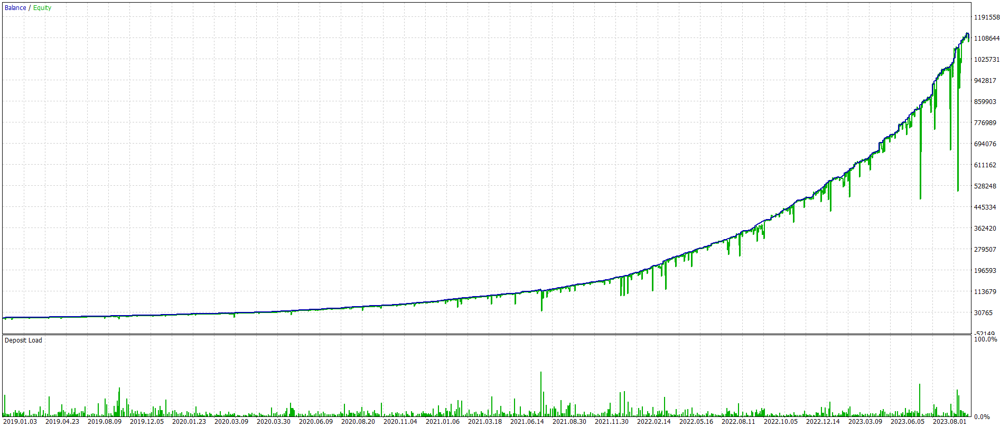
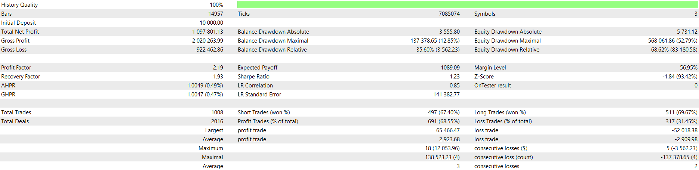

## NWERSIASF - Backtesting Report

-   **Symbol:** Multiple Symbols (USDCAD, AUDUSD, EURCHF)
-   **Time frame:** 2H
-   **Range:** 2019.01.01 - 2023.10.22
-   **Leverage:** 1:200
-   **Margin mode:** Hedging
-   **Broker:** [Alpari](https://alpariforex.org)
-   **Account type:** MT5 - Standard

**Note:** The pure implementation of the strategy explained in this [video](https://youtu.be/Olb47nBRSSo) was not profitable over the long term. The current implementation combines this strategy with the Grid technique, which has made it profitable.

